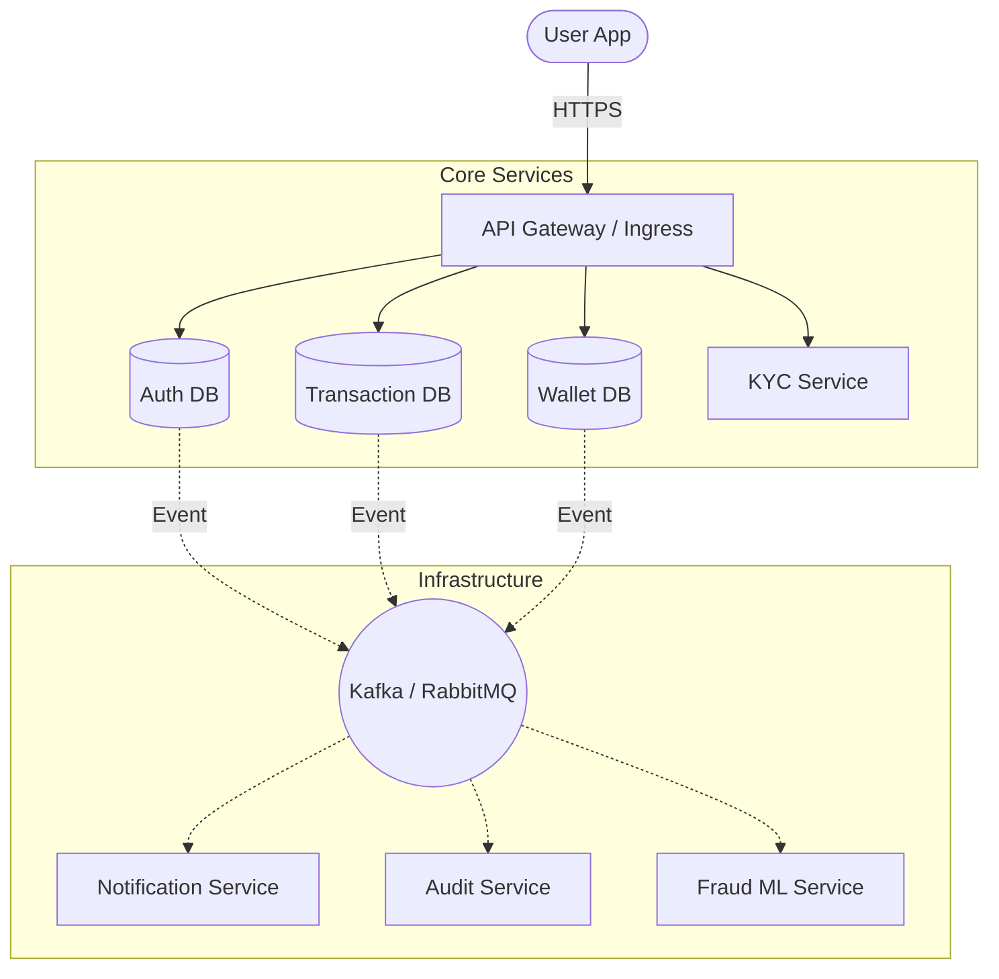

# 🚀 Transition: Modular Monolith → Microservices

This document outlines the roadmap and technical strategy for evolving the NeoBank backend from a **Modular Monolith** into a distributed **Microservices Architecture**.

## 1. Motivation for Transition
- **Independent Scalability:** The `Transactions` service handles high throughput, while `KYC` is compute-intensive.
- **Fault Isolation:** A failure in the `Notification` service should not prevent users from performing `Transfers`.
- **Team Autonomy:** Different teams can work on `Auth`, `Wallets`, and `Fraud` using different release cycles.
- **Technology Diversity:** Future AI/Fraud logic can be written in Python (FastAPI) while core banking remains in NestJS/Go.

---

## 2. Target Architecture (The "To-Be" State)

### High-Level Design


### Key Components
1. **API Gateway:** Central entry point (NestJS Gateway or Kong). Handles Rate Limiting and JWT validation.
2. **Event Bus (Kafka):** The backbone for asynchronous communication (e.g., `transaction.created` → `notification.send`).
3. **Database per Service:** Each microservice owns its schema to prevent tight coupling.

---

## 3. Service Breakdown

| Service | Responsibility | Logic Source (Monolith) |
| :--- | :--- | :--- |
| **Auth Service** | Identity, JWT, MFA, RBAC | `src/modules/auth`, `users` |
| **Wallet Service** | Balances, HD Wallets, Ledger | `src/modules/wallets`, `ledger` |
| **Transaction Service** | P2P Transfers, SAGA, History | `src/modules/transactions` |
| **KYC Service** | Onboarding, iDenfy Webhooks | `src/modules/kyc`, `webhooks` |
| **Notification Service** | Email/Push/SMS dispatch | `src/modules/notifications` |

---

## 4. Implementation Strategy (Phase-by-Phase)

### Phase 1: Shared Library & Shared Context
- Extract common logic (`CryptoUtil`, `Global Guards`, `DTOs`) into a shared workspace (e.g., using **Nx Monorepo**).
- Introduce a Message Broker (RabbitMQ or Kafka) into the Monolith to start emitting events.

### Phase 2: Extraction of Identity (Auth)
- Move `AuthModule` and `UsersModule` into a separate NestJS application.
- All other modules in the monolith will now call `Auth Service` via gRPC or verify JWTs using a shared public key (RS256).

### Phase 3: Extraction of Financials
- Split `Wallets` and `Transactions`.
- **Challenge:** Maintaining atomicity across services.
- **Solution:** Implement the **SAGA Orchestration Pattern** using Kafka to ensure that if a credit fails, the debit is reversed across service boundaries.

---

## 5. How We Work (Developer Workflow)

### 1. Repository Management
We recommend a **Monorepo (Nx)** approach for Phase 1:
- `apps/api-gateway`
- `apps/auth-service`
- `apps/wallet-service`
- `libs/common` (Shared logic)

### 2. Communication Protocols
- **Synchronous (Request/Response):** Use **gRPC** for internal service-to-service calls (High performance, strongly typed with Protobuf).
- **Asynchronous (Event-Driven):** Use **Kafka** for side effects (Notifications, Audit, Analytics).

### 3. Local Development
Use `docker-compose.yml` to spin up infrastructure:
```yaml
services:
  postgres-auth: { ... }
  postgres-wallet: { ... }
  kafka: { ... }
  redis: { ... }
  auth-service: { ... }
  wallet-service: { ... }
```

### 4. Data Consistency
- **No Distributed Transactions:** Use **Idempotency Keys** and **Compensating Transactions** (SAGA).
- **Eventual Consistency:** Balances might take milliseconds to sync across views, but the Ledger remains the source of truth.

---

## 6. Next Immediate Steps
1. [x] Install Nx: `npx create-nx-workspace@latest neobank`
2. [x] Move `src/common` to `libs/common`.
3. [x] Setup a Kafka/RabbitMQ docker container.
4. [x] Refactor `TransactionsService` to emit a `transaction.initiated` event to RabbitMQ.
5. [x] Create a `notification-service` to consume transaction events.
6. [ ] Implement Admin Dashboard for Fraud & KYC review.

---
**Tags:** #architecture #microservices #nest-js #kafka #roadmap
